<picture>
  <source media="(prefers-color-scheme: dark)" srcset="assets/terminal-dark.svg">
  
</picture>

Hi, I'm Idrees. I rebuild websites that already rank on Google, without losing the traffic.

Plenty of developers can build a good-looking Next.js site. Fewer can move a WordPress catalogue or a legacy B2B store onto a modern stack and still have its organic traffic the week after launch. That's the work I'm hired for: redirect maps, canonicals, rendering strategy and Core Web Vitals, handled as part of the build instead of a cleanup ticket afterwards.

I'm based in Karachi and work remotely with clients in the UK, UAE and Europe.

### Right now

- Next.js migrations for sites that depend on organic search
- B2B ecommerce with request-for-quote flows
- Internal tools built on the Claude API

### Selected work

- **[FunkyScore](https://funkyscore.com)**: live sports scores. I built the caching layer that keeps the feed real-time without tripping the Goalserve API's rate limits. React, Node.js.
- **Stainless & Aluminium**: B2B industrial store with a quote request flow. The rebuild focused on lead capture and recovering the crawlability lost in an earlier single-page-app migration. Next.js, PostgreSQL.
- **[Zahar Fragrance](https://zaharfragrance.ae)**: storefront and product catalogue for a UAE fragrance brand. Next.js, CMS.
- **Real estate CRM**: pipeline and client management with auth and dashboards. React, Node.js, PostgreSQL.
- **ResQ AI**: emergency preparedness app with coordinating agents, built for the Replit Buildathon. React, Claude API.
- **SolarBazaar.pk**: concept for a B2B solar marketplace in Pakistan, modelled on NEPRA and AEDB requirements. Next.js, Claude, Gemini.

More in my [portfolio](https://muhammadidrees-dev.vercel.app/portfolio) and [case studies](https://muhammadidrees-dev.vercel.app/case-studies).

### Stack

- **Most days:** Next.js, React, TypeScript, Tailwind CSS, Node.js, PostgreSQL, Supabase
- **Technical SEO:** site migrations, redirect mapping, structured data, crawl and log-file analysis
- **AI:** Claude API, MCP servers, Vercel AI SDK, RAG with pgvector
- **Also:** Python, FastAPI, PHP, WordPress, MongoDB, Docker, AWS, Vercel

### Writing

- [Building scalable React applications with Next.js 15](https://muhammadidrees-dev.vercel.app/blog/building-scalable-react-applications-nextjs-15)
- [Mastering TypeScript: advanced patterns for better code](https://muhammadidrees-dev.vercel.app/blog/mastering-typescript-advanced-patterns)
- [The future of web development: trends to watch](https://muhammadidrees-dev.vercel.app/blog/future-web-development-trends-2024)
- [From junior to senior: a developer's growth journey](https://muhammadidrees-dev.vercel.app/blog/junior-to-senior-developer-journey)

### Get in touch

I'm taking on Next.js rebuilds, SEO-safe migrations, B2B ecommerce and AI features. The fastest way to reach me is [email](mailto:contactmuhammadidrees@gmail.com), or [book a 30-minute call](https://calendly.com/contactmuhammadidrees/30min). I'm also on [LinkedIn](https://linkedin.com/in/muhammad-idrees-khan-796558117) and [X](https://twitter.com/happyikhan).
